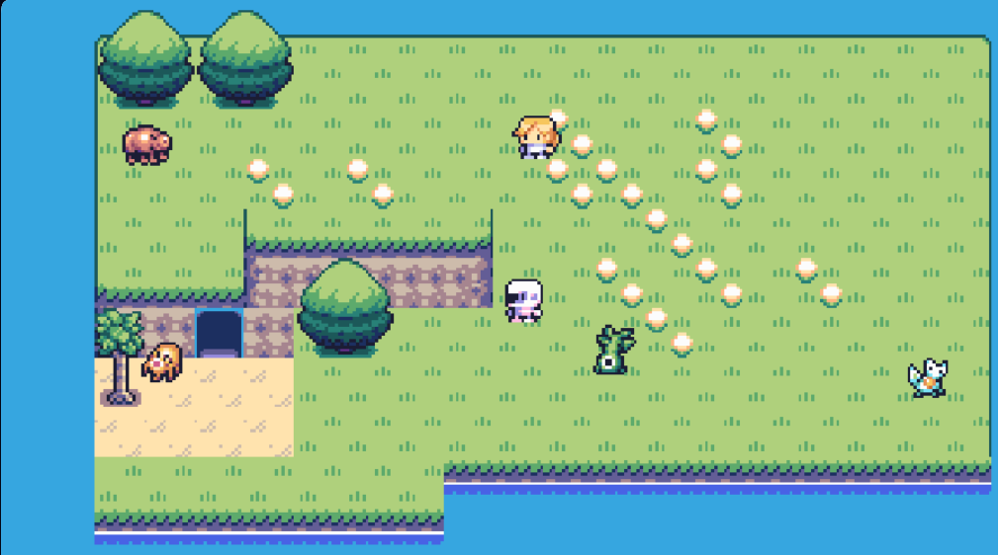
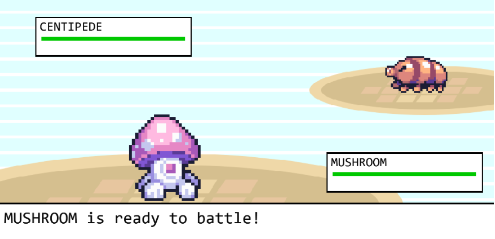
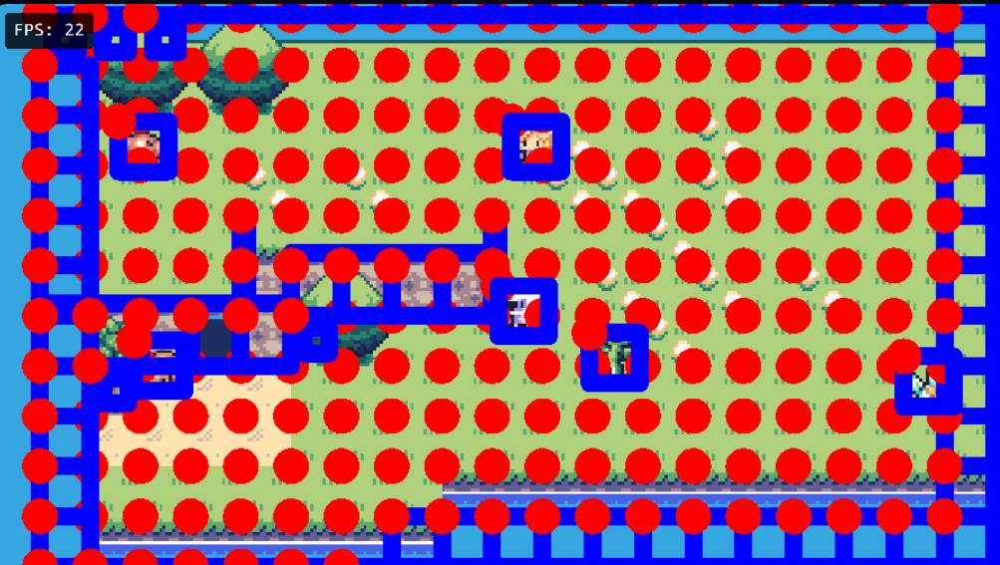

# 2D RPG Game with Kaplay.js

I’m learning to create a **2D RPG game** using [Kaplay.js](https://kaplayjs.com) through this YouTube tutorial:  
[https://youtu.be/zo3crHnFGho?si=aceqMVxoZbjmJr3F](https://youtu.be/zo3crHnFGho?si=aceqMVxoZbjmJr3F)

## Project Purpose
This project is for learning purposes and will help me explore:
- Basic game loop design
- Character movement and interactions
- Map creation
- Event handling in Kaplay.js
- Loading assets for the game
- Creating scenes
- Building the world scene + creating our map
- Creating monsters
- Creating the player and an NPC
- Setting up the camera
- Setting up player movement
- Passing data from one scene to another
- NPC logic
- Implementing battle mechanic + game loop

## Tools Used
- [Kaplay.js](https://kaplayjs.com) — JavaScript game framework
- [Sprite Sheet Slicer](https://www.gamedeveloperstudio.com/tools/spritesheet_slicer.php) — Tool to slice sprite sheets into individual frames
- [Tiled Map Editor](https://www.mapeditor.org/) — Tool to design and build 2D maps

## Screenshot

## Battle Mode

## Debug View – Collision Boxes & Hit Areas

